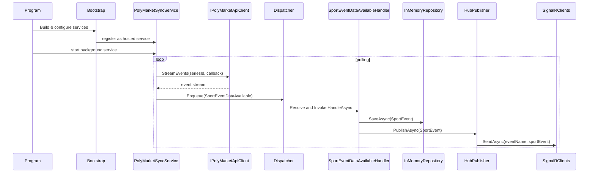

# Trading Engine

This repository contains a minimal ASP.NET Core application that fetches sports betting data from the PolyMarket API, stores it in memory, and streams updates to connected clients using SignalR. The project demonstrates a simple event-dispatching architecture with custom infrastructure components.

## Architecture Overview

- **Startup**: Uses `Application.Bootstrap` and `Application.Configure` extension methods to register services, configure logging, Swagger, CORS, controllers and SignalR.
- **Services**: `PolyMarketSyncService` polls the external API and pushes events to a dispatcher. `DispatcherService` drives the in-process dispatcher.  
    Additionally, `OddsAPIService` runs in the same host and subscribes to `SportEvent` messages via the in‑process `EventBus`, calling a configurable internal API for downstream processing.
- **Dispatcher**: Partitions events by key, resolves a single handler per event type via DI, and invokes it asynchronously.
- **Domain**: `SportEventDataAvailable` events are handled by `SportEventDataAvailableHandler`, which saves `SportEvent` entities and broadcasts them.
- **Repository**: An `InMemoryRepository` provides thread-safe storage for entities.
- **EventBus & Hub**: Lightweight pub/sub (`EventBus`) and SignalR publishing (`HubPublisher`).

## Sequence Diagram

Below is a sequence diagram illustrating the main runtime flow of the application:

### Flow Explanation

1. **Initialization**: `Program` creates the web application builder and calls custom bootstrap/configure methods. Services including the HTTP client, dispatcher, repository, and Hub publisher are registered.
2. **Background Processing**: `PolyMarketSyncService` starts as a hosted service. It repeatedly calls `IPolyMarketApiClient.StreamEvents`, which fetches live event data from PolyMarket.
3. **Event Dispatching**: Each received event is mapped to a `SportEventDataAvailable` and enqueued with the `Dispatcher`.
4. **Handling Events**: The dispatcher activates the appropriate handler (`SportEventDataAvailableHandler`), which constructs a `SportEvent` object and saves it using the in-memory repository.
5. **Publishing**: After persisting, the handler uses `HubPublisher<SportEvent>` to broadcast the new event over SignalR to all connected clients.

The diagram above captures these interactions and highlights how each component collaborates to move data from the external API to real-time clients.

---

Feel free to explore the code under `src/TradingEngine` to see the implementation details and extend the system with new event types, handlers, or external data sources.